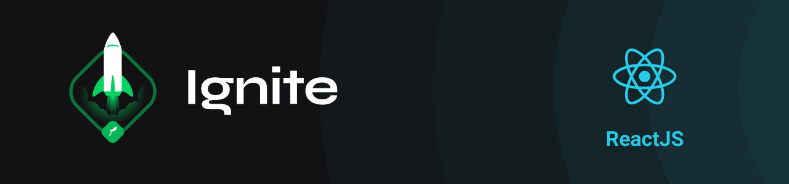

  

 

<h1 align="center">
  Ignite

   

  Trilha ReactJS (aulas)
</h1>

 

  
  
  

 

## Índice

### Projeto I
- [Fundamentos do ReactJS](01-fundamentos-reactjs/)
- [Ignite Feed](https://github.com/lfnd0/feed)
